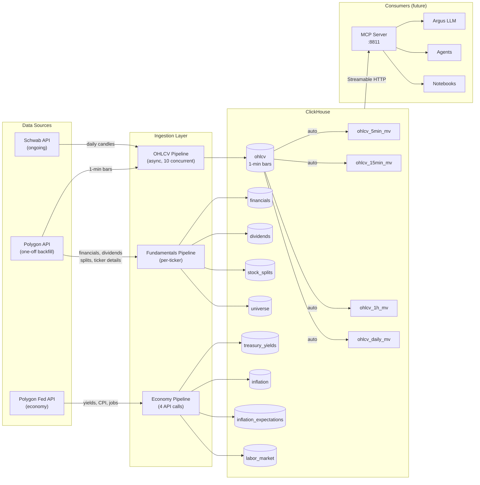
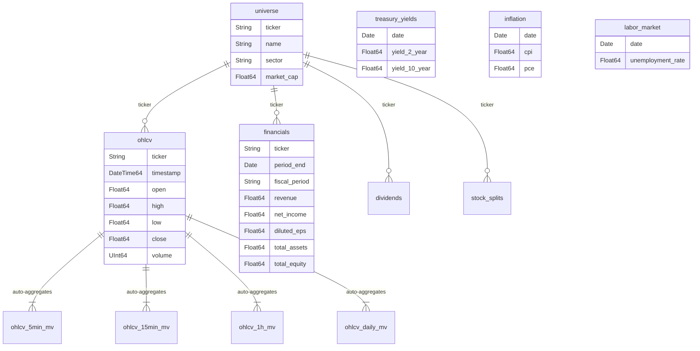

# argus-dataplat

A quantitative data platform built on **ClickHouse** — stores 1-minute OHLCV bars for thousands of tickers with auto-aggregated views at 5-min, 15-min, hourly, and daily resolutions. Ingests from **Schwab** (ongoing market data) and **Polygon** (one-off historical backfill).

Part of the [Argus](https://github.com/3Epsilon) ecosystem. This is the **data infrastructure layer** — a separate Python project from the Argus TypeScript/Electron desktop app.

---

## Architecture



### Key Design Decisions

- **1-minute bars as the base resolution.** Coarser views are ClickHouse materialized views that auto-update on insert — zero maintenance.
- **`CODEC(Delta, ZSTD(1))`** on all numeric columns. Benchmarked at **~21 bytes/row** (vs 34 bytes default LZ4). 3,000 tickers × 4 years of 1-min data = **~43 GB on disk**.
- **Schwab for all ticker data going forward.** Polygon is used once to seed the 1-min historical base (4 years), then never again for price data.
- **Polars everywhere.** Pandas is not imported. The only exception: `.to_pandas()` at the ClickHouse insert boundary if `insert_arrow()` doesn't work.
- **Kafka-ready pipeline interfaces.** Extract → Transform → Load with clean seams. Kafka can be inserted between Extract and Transform later without rewriting anything.

---

## Prerequisites

| Tool | Version | Install |
|------|---------|---------|
| **Python** | ≥ 3.12 | [python.org](https://www.python.org/) |
| **uv** | latest | `curl -LsSf https://astral.sh/uv/install.sh \| sh` |
| **Docker** | latest | [docker.com](https://www.docker.com/) |
| **just** | latest | `brew install just` or [casey/just](https://github.com/casey/just) |

### API Keys Required

| Key | What it's for | Get it at |
|-----|---------------|-----------|
| `SCHWAB_APP_KEY` + `SCHWAB_APP_SECRET` | All ticker-level market data (OHLCV, quotes, options, streaming) | [developer.schwab.com](https://developer.schwab.com) |
| `POLYGON_API_KEY` | One-off 1-min backfill + ticker universe reference data | [polygon.io](https://polygon.io) |
| `FRED_API_KEY` *(optional)* | Economic indicators (GDP, CPI, rates) | [fred.stlouisfed.org](https://fred.stlouisfed.org/docs/api/api_key.html) |

> **Schwab note:** You need both "Accounts and Trading Production" and "Market Data Production" APIs enabled on your Schwab developer app. On first run, schwabdev will open a browser for OAuth login — use your regular Schwab brokerage credentials, not developer portal credentials.

---

## Quick Start

### 1. Clone and install

```bash
git clone https://github.com/3Epsilon/argus-dataplat.git
cd argus-dataplat

# Install Python dependencies
uv sync
```

### 2. Configure environment

```bash
cp .env.example .env
# Edit .env and fill in your API keys
```

### 3. Start ClickHouse

```bash
just up
just ch-ping    # should print "ClickHouse is up"
```

### 4. Run migrations

```bash
just migrate
```

This creates the `dataplat` database with all tables and materialized views:

| Table | Description |
|-------|-------------|
| `ohlcv` | 1-minute OHLCV bars (base table) |
| `ohlcv_5min_mv` | Auto-aggregated 5-minute bars |
| `ohlcv_15min_mv` | Auto-aggregated 15-minute bars |
| `ohlcv_1h_mv` | Auto-aggregated 1-hour bars |
| `ohlcv_daily_mv` | Auto-aggregated daily bars |
| `universe` | Ticker metadata (symbol, name, exchange, sector, description, CIK) |
| `financials` | Structured financial statements (income, balance, cash flow + JSON overflow) |
| `dividends` | Historical cash dividends |
| `stock_splits` | Historical stock splits |
| `treasury_yields` | US Treasury yields (1962–present, daily) |
| `inflation` | CPI and PCE metrics (1947–present, monthly) |
| `inflation_expectations` | Market and model-based expectations (1982–present) |
| `labor_market` | Unemployment, participation, earnings (1948–present) |
| `economic_series` | Generic FRED series (future) |
| `option_chains` | Option snapshots (future, Schwab) |

### 5. Backfill data

**Polygon 1-minute backfill** (one-off, ~4 years of history):

```bash
# Single ticker test
just backfill --source polygon --tickers AAPL

# Multiple tickers
just backfill --source polygon --tickers AAPL,MSFT,GOOGL,AMZN,TSLA

# Full universe (requires universe table to be seeded first)
just backfill --source polygon --universe --concurrency 10
```

**Schwab daily backfill** (20 years of daily candles):

```bash
# First run will open browser for Schwab OAuth login
just backfill --source schwab --tickers AAPL,MSFT --years 20
```

### 6. Query your data

```bash
just ch-shell
```

```sql
-- Latest daily bars
SELECT * FROM ohlcv_daily_mv
WHERE ticker = 'AAPL'
ORDER BY day DESC
LIMIT 10;

-- 5-minute bars for today
SELECT * FROM ohlcv_5min_mv
WHERE ticker = 'AAPL' AND bucket >= today()
ORDER BY bucket;

-- Cross-ticker volume leaders
SELECT ticker, sum(volume) AS total_vol
FROM ohlcv_daily_mv
WHERE day = today() - 1
GROUP BY ticker
ORDER BY total_vol DESC
LIMIT 20;

-- Storage stats
SELECT
    name,
    formatReadableQuantity(total_rows) AS rows,
    formatReadableSize(total_bytes) AS size
FROM system.tables
WHERE database = 'dataplat'
ORDER BY total_rows DESC;
```

---

## Project Structure

```
argus-dataplat/
├── pyproject.toml                 # uv/hatch project config
├── docker-compose.yml             # ClickHouse (+ Redpanda later)
├── justfile                       # Task runner
├── .env.example                   # Required environment variables
│
├── src/dataplat/
│   ├── config.py                  # pydantic-settings env loading
│   ├── db/
│   │   ├── client.py              # ClickHouse client factory
│   │   ├── migrate.py             # Schema migration runner
│   │   └── migrations/            # 12 numbered SQL migration files
│   ├── ingestion/
│   │   ├── base.py                # Abstract IngestPipeline
│   │   ├── schwab/
│   │   │   ├── client.py          # schwabdev wrapper
│   │   │   └── historical.py      # Daily OHLCV backfill
│   │   ├── polygon/
│   │   │   ├── backfill_1min.py   # One-off 1-min OHLCV backfill
│   │   │   ├── fundamentals.py    # Financials, dividends, splits, ticker details
│   │   │   ├── economy.py         # Treasury yields, inflation, labor market
│   │   │   └── universes/         # SPY, QQQ ticker lists + fetch_all.py
│   │   └── fred/                  # (future)
│   ├── transforms/
│   │   ├── ohlcv.py               # Polygon/Schwab → Polars DataFrame
│   │   └── validation.py          # Schema enforcement, dedup
│   └── cli/
│       ├── migrate.py             # python -m dataplat.cli.migrate
│       ├── backfill.py            # python -m dataplat.cli.backfill
│       └── backfill_fundamentals.py # python -m dataplat.cli.backfill_fundamentals
│
├── queries/                       # 12 saved SQL queries (regime, macro, fundamentals)
├── tests/
│   ├── conftest.py                # Shared fixtures
│   └── test_transforms/
│       └── test_ohlcv.py          # Transform unit tests
│
└── scripts/
    └── schwab_quotes_to_clickhouse.py  # Original POC (reference)
```

---

## Commands Reference

All commands use [just](https://github.com/casey/just):

| Command | Description |
|---------|-------------|
| `just up` | Start ClickHouse in Docker |
| `just down` | Stop ClickHouse |
| `just reset` | Nuke all data and re-migrate |
| `just migrate` | Apply pending schema migrations |
| `just backfill --source polygon --tickers AAPL` | Polygon 1-min backfill |
| `just backfill --source polygon --universe spy` | Polygon 1-min backfill for S&P 500 |
| `just backfill --source schwab --tickers AAPL --years 20` | Schwab daily backfill |
| `just backfill-fundamentals --universe spy` | Financials, dividends, splits for SPY |
| `just backfill-fundamentals --economy` | Treasury yields, inflation, labor market |
| `just ch-shell` | Interactive ClickHouse SQL shell |
| `just ch-ping` | Health check |
| `just ch-stats` | Show table row counts and sizes |
| `just test` | Run pytest |
| `just lint` | Ruff lint + format check |
| `just fix` | Auto-fix lint issues |

---

## Data Source Boundaries

| Provider | Owns | Never Used For |
|----------|------|----------------|
| **Schwab** | ALL ticker-level data going forward: OHLCV, quotes, streaming, options | — |
| **Polygon** | One-off 1-min backfill (tagged `source='polygon_backfill'`), ticker universe, news, corporate actions | Ongoing price data |
| **FRED** | Economic indicators (GDP, CPI, unemployment, rates) | — |
| **SEC EDGAR** | Full financial statements (income, balance sheet, cash flow) | — |

---

## ClickHouse Schema



**Compression:** `CODEC(Delta, ZSTD(1))` on all numeric columns — benchmarked at ~21 bytes/row. For 3,000 tickers × 4 years of 1-min data: **~43 GB on disk**.

---

## Development

```bash
# Install dev dependencies
uv sync --all-extras

# Run tests
just test

# Lint
just lint

# Auto-fix
just fix
```

### Adding a new migration

1. Create `src/dataplat/db/migrations/NNN_description.sql`
2. Run `just migrate`
3. The migration runner tracks applied versions in the `_migrations` table

### Adding a new ingestion pipeline

1. Create a new module under `src/dataplat/ingestion/`
2. Implement the `IngestPipeline` interface from `base.py`
3. Add transform logic in `src/dataplat/transforms/`
4. Wire into the CLI

---

## Roadmap

- [x] ClickHouse schema + migrations (12 migrations)
- [x] Polygon 1-min OHLCV backfill pipeline (async, concurrent)
- [x] Schwab daily OHLCV backfill pipeline
- [x] Materialized views (5-min, 15-min, hourly, daily)
- [x] Fundamentals backfill (financials, dividends, splits, ticker details)
- [x] Economy backfill (treasury yields, inflation, expectations, labor market)
- [x] Universe files (SPY, QQQ, dynamic fetch-all)
- [x] Query library (12 saved queries: regime, macro, fundamentals, cross-asset)
- [ ] Schwab streaming → Kafka → ClickHouse
- [ ] MCP server (tool-based API for Argus LLM)
- [ ] Argus MCP client integration

---

## License

Private — part of the Argus project by 3Epsilon.
